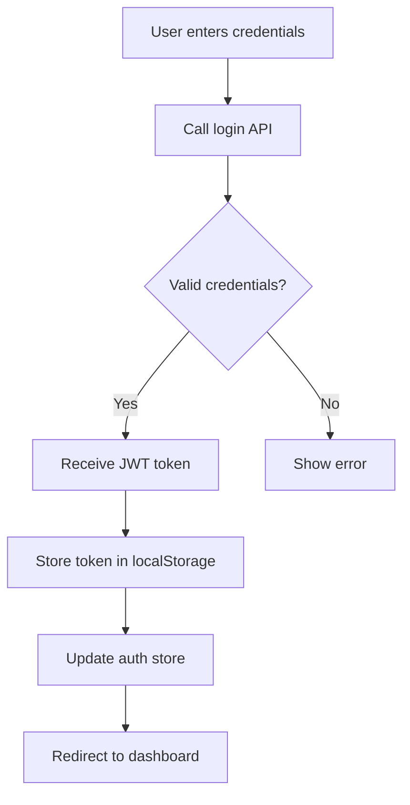

# Frontend Setup Guide - Codevertex ISP Billing System

## Table of Contents
1. [Introduction](#introduction)
2. [Prerequisites](#prerequisites)
3. [Project Overview](#project-overview)
4. [Environment Setup](#environment-setup)
5. [Development Setup](#development-setup)
6. [Configuration](#configuration)
7. [Running the Application](#running-the-application)
8. [Building for Production](#building-for-production)
9. [UI Components](#ui-components)
10. [State Management](#state-management)
11. [API Integration](#api-integration)
12. [Routing & Navigation](#routing--navigation)
13. [Authentication Flow](#authentication-flow)
14. [RBAC Implementation](#rbac-implementation)
15. [Theming & Styling](#theming--styling)
16. [PWA Configuration](#pwa-configuration)
17. [Testing](#testing)
18. [Deployment](#deployment)
19. [Troubleshooting](#troubleshooting)
20. [Best Practices](#best-practices)

---

## Introduction

The Codevertex ISP Billing System frontend is a modern, responsive web application built with Next.js 16, TypeScript, and shadcn/ui. It provides a complete user interface for managing ISP operations, from customer management to router provisioning.

### Key Features
- **Server-Side Rendering (SSR)**: Fast page loads with Next.js App Router
- **Type Safety**: Full TypeScript coverage
- **Modern UI**: shadcn/ui components built on Radix UI
- **Real-time Updates**: WebSocket support for live data
- **Responsive Design**: Mobile-first approach
- **PWA Support**: Offline capabilities and installability
- **RBAC Integration**: Role-based UI rendering
- **Dark Mode**: Theme switching support

---

## Prerequisites

### Required Software

#### 1. Node.js (v18.x or higher)
```bash
# Check Node.js version
node --version

# Should output: v18.x.x or higher
```

**Download**: https://nodejs.org/

**Recommended**: Use Node Version Manager (nvm)
```bash
# Install nvm (Linux/MacOS)
curl -o- https://raw.githubusercontent.com/nvm-sh/nvm/v0.39.0/install.sh | bash

# Install Node.js
nvm install 18
nvm use 18
```

#### 2. npm or yarn
```bash
# npm comes with Node.js
npm --version

# Or install yarn
npm install -g yarn
yarn --version
```

#### 3. Git
```bash
# Check Git version
git --version
```

**Download**: https://git-scm.com/downloads

#### 4. Code Editor
Recommended: **Visual Studio Code** with extensions:
- ESLint
- Prettier
- Tailwind CSS IntelliSense
- TypeScript Vue Plugin (Volar)
- Auto Rename Tag
- Path Intellisense

### Optional Tools
- **Docker**: For containerized development
- **Postman**: For API testing
- **React DevTools**: Browser extension for debugging

---

## Project Overview

### Technology Stack

#### Core Framework
- **Next.js 16**: React framework with App Router
- **React 19**: UI library
- **TypeScript 5**: Type-safe development

#### Styling & UI
- **Tailwind CSS 3**: Utility-first CSS framework
- **shadcn/ui**: Component library (Radix UI + Tailwind)
- **Lucide React**: Icon library
- **next-themes**: Dark mode support

#### State Management
- **Zustand**: Lightweight state management
- **TanStack Query 5**: Server state management
- **LocalStorage**: Client-side persistence

#### Forms & Validation
- **React Hook Form**: Form management
- **Zod**: Schema validation

#### Data Fetching
- **Axios**: HTTP client
- **TanStack Query**: Caching and synchronization

#### Charts & Visualization
- **Recharts**: React charting library
- **React Quill**: Rich text editor

#### Notifications
- **Sonner**: Toast notifications

### Project Structure
```
frontend/
├── app/                        # Next.js App Router
│   ├── (auth)/                # Authentication routes
│   ├── (dashboard)/           # Protected dashboard routes
│   ├── (marketing)/           # Public marketing pages
│   ├── layout.tsx             # Root layout
│   ├── globals.css            # Global styles
│   └── not-found.tsx          # 404 page
├── components/                 # Reusable components
│   ├── ui/                    # shadcn/ui base components
│   ├── auth/                  # Auth-specific components
│   ├── dashboard/             # Dashboard components
│   ├── forms/                 # Form components
│   ├── tables/                # Table components
│   ├── charts/                # Chart components
│   ├── navigation/            # Navigation components
│   ├── marketing/             # Marketing components
│   ├── rbac/                  # RBAC components
│   └── brand/                 # Branding components
├── features/                   # Feature modules
│   ├── auth/                  # Authentication
│   ├── users/                 # User management
│   ├── packages/              # Package management
│   ├── routers/               # Router management
│   ├── billing/               # Billing & payments
│   ├── sms/                   # SMS management
│   ├── reports/               # Reports & analytics
│   └── settings/              # Settings
├── lib/                        # Utilities
│   ├── api.ts                 # API client
│   ├── utils.ts               # Utility functions
│   ├── constants.ts           # Constants
│   └── store/                 # Zustand stores
├── hooks/                      # Custom React hooks
├── types/                      # TypeScript types
├── public/                     # Static assets
└── docs/                       # Documentation
```

---

## Environment Setup

### 1. Clone Repository
```bash
# Clone the repository
git clone <repository-url>
cd ISPBilling

# Navigate to frontend directory
cd isp-billing-frontend
```

### 2. Install Dependencies
```bash
# Using npm
npm install

# Or using yarn
yarn install

# Or using pnpm
pnpm install
```

**Note**: This will install all dependencies listed in `package.json`.

### 3. Verify Installation
```bash
# Check installed packages
npm list --depth=0

# Verify Next.js installation
npx next --version
```

---

## Configuration

### Environment Variables

#### 1. Copy Environment Template
```bash
cp .env.example .env.local
```

#### 2. Edit `.env.local`
```ini
# API Configuration
NEXT_PUBLIC_API_BASE_URL=http://localhost:8000/api/v1
NEXT_PUBLIC_WS_URL=ws://localhost:8000

# Application Settings
NEXT_PUBLIC_APP_NAME="Codevertex ISP Billing"
NEXT_PUBLIC_APP_VERSION=1.0.0
NEXT_PUBLIC_COMPANY_NAME="Codevertex Africa Limited"

# Feature Flags
NEXT_PUBLIC_ENABLE_DEMO_MODE=true
NEXT_PUBLIC_ENABLE_REGISTRATION=true
NEXT_PUBLIC_ENABLE_PWA=true
NEXT_PUBLIC_ENABLE_DARK_MODE=true

# Analytics (Optional)
NEXT_PUBLIC_GA_TRACKING_ID=
NEXT_PUBLIC_SENTRY_DSN=
NEXT_PUBLIC_HOTJAR_ID=

# Map Provider (Optional)
NEXT_PUBLIC_MAPBOX_TOKEN=
NEXT_PUBLIC_GOOGLE_MAPS_API_KEY=

# Payment Gateway (Optional)
NEXT_PUBLIC_STRIPE_PUBLIC_KEY=
NEXT_PUBLIC_PAYPAL_CLIENT_ID=

# Development Settings
NEXT_PUBLIC_DEBUG_MODE=true
NEXT_PUBLIC_LOG_LEVEL=debug
```

#### 3. Environment Variable Descriptions

**Required Variables**:
- `NEXT_PUBLIC_API_BASE_URL`: Backend API base URL (e.g., http://localhost:8000/api/v1)
- `NEXT_PUBLIC_APP_NAME`: Application display name

**Optional Variables**:
- `NEXT_PUBLIC_WS_URL`: WebSocket server URL for real-time updates
- `NEXT_PUBLIC_GA_TRACKING_ID`: Google Analytics tracking ID
- `NEXT_PUBLIC_ENABLE_DEMO_MODE`: Show demo data on landing page

**Note**: All variables prefixed with `NEXT_PUBLIC_` are exposed to the browser.

---

## Development Setup

### 1. Install shadcn/ui Components

The project uses shadcn/ui. Initial components are already installed, but to add new ones:

```bash
# Add a new component
npx shadcn-ui@latest add button

# Add multiple components
npx shadcn-ui@latest add dropdown-menu dialog alert
```

### 2. Configure Tailwind CSS

Tailwind is pre-configured in `tailwind.config.ts`. To customize:

```typescript
// tailwind.config.ts
import type { Config } from 'tailwindcss'

const config: Config = {
  darkMode: ['class'],
  content: [
    './pages/**/*.{ts,tsx}',
    './components/**/*.{ts,tsx}',
    './app/**/*.{ts,tsx}',
    './features/**/*.{ts,tsx}',
  ],
  theme: {
    extend: {
      colors: {
        // Add custom colors
        primary: {
          50: '#eff6ff',
          // ... more shades
        },
      },
    },
  },
  plugins: [require('tailwindcss-animate')],
}

export default config
```

### 3. Configure TypeScript

TypeScript is configured in `tsconfig.json`:

```json
{
  "compilerOptions": {
    "target": "ES2020",
    "lib": ["dom", "dom.iterable", "esnext"],
    "allowJs": true,
    "skipLibCheck": true,
    "strict": true,
    "forceConsistentCasingInFileNames": true,
    "noEmit": true,
    "esModuleInterop": true,
    "module": "esnext",
    "moduleResolution": "bundler",
    "resolveJsonModule": true,
    "isolatedModules": true,
    "jsx": "preserve",
    "incremental": true,
    "plugins": [
      {
        "name": "next"
      }
    ],
    "paths": {
      "@/*": ["./*"]
    }
  },
  "include": ["next-env.d.ts", "**/*.ts", "**/*.tsx", ".next/types/**/*.ts"],
  "exclude": ["node_modules"]
}
```

---

## Running the Application

### Development Mode

#### 1. Start Development Server
```bash
# Using npm
npm run dev

# Or using yarn
yarn dev

# Or using pnpm
pnpm dev
```

**Default URL**: http://localhost:3000

#### 2. With Custom Port
```bash
# Use a different port
npm run dev -- -p 3001
```

#### 3. With Turbopack (Faster)
```bash
# Use Next.js Turbopack for faster builds
npm run dev -- --turbo
```

### Production Preview

```bash
# Build the application
npm run build

# Start production server
npm run start
```

---

## Building for Production

### 1. Production Build
```bash
# Create optimized production build
npm run build
```

This will:
- ✅ Compile TypeScript
- ✅ Bundle JavaScript modules
- ✅ Optimize images
- ✅ Generate static pages
- ✅ Create production bundles

### 2. Analyze Bundle Size
```bash
# Install analyzer
npm install -D @next/bundle-analyzer

# Add to next.config.js
const withBundleAnalyzer = require('@next/bundle-analyzer')({
  enabled: process.env.ANALYZE === 'true',
})

module.exports = withBundleAnalyzer({
  // ... your config
})

# Run analysis
ANALYZE=true npm run build
```

### 3. Production Environment Variables

Create `.env.production`:
```ini
NEXT_PUBLIC_API_BASE_URL=https://api.yourdomain.com/api/v1
NEXT_PUBLIC_WS_URL=wss://api.yourdomain.com
NEXT_PUBLIC_APP_NAME="Codevertex ISP Billing"
NEXT_PUBLIC_ENABLE_DEMO_MODE=false
NEXT_PUBLIC_DEBUG_MODE=false
```

---

## UI Components

### shadcn/ui Components

#### Available Components
The project includes the following shadcn/ui components:

**Forms**:
- Button
- Input
- Textarea
- Select
- Checkbox
- Radio Group
- Switch
- Label
- Form

**Data Display**:
- Table
- Card
- Badge
- Avatar
- Separator
- Skeleton

**Overlays**:
- Dialog
- Alert Dialog
- Sheet
- Dropdown Menu
- Popover
- Tooltip
- Toast

**Navigation**:
- Tabs
- Accordion
- Command

#### Using Components

```tsx
import { Button } from '@/components/ui/button'
import { Card } from '@/components/ui/card'

export default function Example() {
  return (
    <Card>
      <Button variant="default" size="lg">
        Click Me
      </Button>
    </Card>
  )
}
```

#### Creating Custom Components

```tsx
// components/custom/MyComponent.tsx
'use client'

import { Button } from '@/components/ui/button'
import { Card, CardContent, CardHeader, CardTitle } from '@/components/ui/card'

interface MyComponentProps {
  title: string
  onAction: () => void
}

export function MyComponent({ title, onAction }: MyComponentProps) {
  return (
    <Card>
      <CardHeader>
        <CardTitle>{title}</CardTitle>
      </CardHeader>
      <CardContent>
        <Button onClick={onAction}>Action</Button>
      </CardContent>
    </Card>
  )
}
```

---

## State Management

### Zustand Stores

#### 1. Auth Store (`lib/store/auth.ts`)

Manages authentication state:

```typescript
import { create } from 'zustand'
import { persist } from 'zustand/middleware'

interface AuthState {
  user: User | null
  token: string | null
  isAuthenticated: boolean
  login: (credentials: LoginCredentials) => Promise<void>
  logout: () => void
  checkAuth: () => Promise<void>
}

export const useAuthStore = create<AuthState>()(
  persist(
    (set, get) => ({
      user: null,
      token: null,
      isAuthenticated: false,
      
      login: async (credentials) => {
        // Login logic
      },
      
      logout: () => {
        set({ user: null, token: null, isAuthenticated: false })
        localStorage.removeItem('token')
      },
      
      checkAuth: async () => {
        // Check authentication
      },
    }),
    {
      name: 'auth-storage',
    }
  )
)
```

**Usage**:
```tsx
import { useAuthStore } from '@/lib/store/auth'

export default function Component() {
  const { user, login, logout } = useAuthStore()
  
  return (
    <div>
      {user ? (
        <button onClick={logout}>Logout</button>
      ) : (
        <button onClick={() => login({ username: 'demo', password: 'demo123' })}>
          Login
        </button>
      )}
    </div>
  )
}
```

#### 2. RBAC Store (`lib/store/rbac.ts`)

Manages roles and permissions:

```typescript
export const useRBACStore = create<RBACState>((set, get) => ({
  userRole: null,
  userPermissions: [],
  licence: null,
  
  hasPermission: (module, action, resource?) => {
    const { userPermissions, userRole } = get()
    
    // Superuser has all permissions
    if (userRole === 'superuser') return true
    
    // Check permissions
    return userPermissions.some(
      p => p.module === module && p.action === action
    )
  },
  
  hasRole: (roles) => {
    const { userRole } = get()
    return roles.includes(userRole!)
  },
}))
```

**Usage**:
```tsx
import { useRBACStore } from '@/lib/store/rbac'

export default function Component() {
  const { hasPermission } = useRBACStore()
  
  return (
    <div>
      {hasPermission('USERS', 'CREATE') && (
        <button>Create User</button>
      )}
    </div>
  )
}
```

### React Query (TanStack Query)

#### Configuration (`lib/api.ts`)

```typescript
import { QueryClient } from '@tanstack/react-query'

export const queryClient = new QueryClient({
  defaultOptions: {
    queries: {
      staleTime: 1000 * 60 * 5, // 5 minutes
      gcTime: 1000 * 60 * 30, // 30 minutes
      retry: 1,
      refetchOnWindowFocus: false,
    },
  },
})
```

#### Using Queries

```typescript
// features/users/api.ts
import { useQuery } from '@tanstack/react-query'
import api from '@/lib/api'

export function useUsers(params?: UserQueryParams) {
  return useQuery({
    queryKey: ['users', params],
    queryFn: async () => {
      const response = await api.get('/users', { params })
      return response.data
    },
  })
}
```

**Usage in Component**:
```tsx
import { useUsers } from '@/features/users/api'

export default function UsersPage() {
  const { data, isLoading, error } = useUsers({ page: 1, limit: 10 })
  
  if (isLoading) return <Skeleton />
  if (error) return <Error error={error} />
  
  return (
    <div>
      {data.users.map(user => (
        <UserCard key={user.id} user={user} />
      ))}
    </div>
  )
}
```

#### Using Mutations

```typescript
export function useCreateUser() {
  const queryClient = useQueryClient()
  
  return useMutation({
    mutationFn: async (data: CreateUserData) => {
      const response = await api.post('/users', data)
      return response.data
    },
    onSuccess: () => {
      queryClient.invalidateQueries({ queryKey: ['users'] })
      toast.success('User created successfully')
    },
    onError: (error) => {
      toast.error('Failed to create user')
    },
  })
}
```

---

## API Integration

### Axios Configuration

#### Base Setup (`lib/api.ts`)

```typescript
import axios from 'axios'
import { useAuthStore } from './store/auth'

const api = axios.create({
  baseURL: process.env.NEXT_PUBLIC_API_BASE_URL,
  timeout: 30000,
  headers: {
    'Content-Type': 'application/json',
  },
})

// Request interceptor
api.interceptors.request.use(
  (config) => {
    const token = useAuthStore.getState().token
    if (token) {
      config.headers.Authorization = `Bearer ${token}`
    }
    return config
  },
  (error) => Promise.reject(error)
)

// Response interceptor
api.interceptors.response.use(
  (response) => response,
  async (error) => {
    if (error.response?.status === 401) {
      useAuthStore.getState().logout()
      window.location.href = '/login'
    }
    return Promise.reject(error)
  }
)

export default api
```

### API Store (`lib/store/api.ts`)

```typescript
interface APIState {
  baseURL: string
  token: string | null
  setToken: (token: string | null) => void
  makeRequest: <T>(url: string, options?: RequestOptions) => Promise<T>
}

export const useApiStore = create<APIState>((set, get) => ({
  baseURL: process.env.NEXT_PUBLIC_API_BASE_URL || '',
  token: null,
  
  setToken: (token) => set({ token }),
  
  makeRequest: async (url, options = {}) => {
    const { token, baseURL } = get()
    const fullURL = `${baseURL}${url}`
    
    const response = await fetch(fullURL, {
      ...options,
      headers: {
        'Content-Type': 'application/json',
        ...(token && { Authorization: `Bearer ${token}` }),
        ...options.headers,
      },
    })
    
    if (!response.ok) {
      throw new Error('API request failed')
    }
    
    return response.json()
  },
}))
```

---

## Routing & Navigation

### App Router Structure

```
app/
├── (auth)/                    # Auth route group (no dashboard layout)
│   ├── login/page.tsx
│   ├── signup/page.tsx
│   ├── forgot-password/page.tsx
│   └── reset-password/page.tsx
├── (dashboard)/               # Dashboard route group (with sidebar)
│   ├── layout.tsx            # Dashboard layout
│   ├── dashboard/page.tsx
│   ├── users/page.tsx
│   ├── packages/page.tsx
│   └── routers/page.tsx
└── (marketing)/               # Marketing route group (public)
    ├── page.tsx              # Landing page
    ├── pricing/page.tsx
    └── contact/page.tsx
```

### Navigation Component (`components/navigation/Navbar.tsx`)

```tsx
'use client'

import Link from 'next/link'
import { usePathname } from 'next/navigation'

export function Navbar() {
  const pathname = usePathname()
  
  return (
    <nav>
      <Link 
        href="/dashboard" 
        className={pathname === '/dashboard' ? 'active' : ''}
      >
        Dashboard
      </Link>
      <Link 
        href="/users" 
        className={pathname === '/users' ? 'active' : ''}
      >
        Users
      </Link>
    </nav>
  )
}
```

### Programmatic Navigation

```tsx
'use client'

import { useRouter } from 'next/navigation'

export default function Component() {
  const router = useRouter()
  
  const handleSubmit = async () => {
    // ... submit logic
    router.push('/dashboard')
    router.refresh() // Refresh server components
  }
  
  return <button onClick={handleSubmit}>Submit</button>
}
```

---

## Authentication Flow

### Login Flow



### Implementation

```tsx
// app/(auth)/login/page.tsx
'use client'

import { useState } from 'react'
import { useRouter } from 'next/navigation'
import { useAuthStore } from '@/lib/store/auth'
import { Button } from '@/components/ui/button'
import { Input } from '@/components/ui/input'

export default function LoginPage() {
  const router = useRouter()
  const { login } = useAuthStore()
  const [isLoading, setIsLoading] = useState(false)
  
  const handleSubmit = async (e: React.FormEvent<HTMLFormElement>) => {
    e.preventDefault()
    setIsLoading(true)
    
    const formData = new FormData(e.currentTarget)
    const credentials = {
      username: formData.get('username') as string,
      password: formData.get('password') as string,
    }
    
    try {
      await login(credentials)
      router.push('/dashboard')
    } catch (error) {
      toast.error('Invalid credentials')
    } finally {
      setIsLoading(false)
    }
  }
  
  return (
    <form onSubmit={handleSubmit}>
      <Input name="username" placeholder="Username" />
      <Input name="password" type="password" placeholder="Password" />
      <Button type="submit" disabled={isLoading}>
        {isLoading ? 'Logging in...' : 'Login'}
      </Button>
    </form>
  )
}
```

### Protected Routes

```tsx
// components/auth/AuthGuard.tsx
'use client'

import { useEffect } from 'react'
import { useRouter } from 'next/navigation'
import { useAuthStore } from '@/lib/store/auth'

export function AuthGuard({ children }: { children: React.ReactNode }) {
  const router = useRouter()
  const { isAuthenticated, checkAuth } = useAuthStore()
  
  useEffect(() => {
    checkAuth().catch(() => router.push('/login'))
  }, [])
  
  if (!isAuthenticated) {
    return <div>Loading...</div>
  }
  
  return <>{children}</>
}
```

**Usage in Layout**:
```tsx
// app/(dashboard)/layout.tsx
import { AuthGuard } from '@/components/auth/AuthGuard'

export default function DashboardLayout({ children }: { children: ReactNode }) {
  return (
    <AuthGuard>
      <div className="dashboard-layout">
        {children}
      </div>
    </AuthGuard>
  )
}
```

---

## RBAC Implementation

### Permission Gate Component

```tsx
// components/rbac/PermissionGate.tsx
'use client'

import { useRBACStore } from '@/lib/store/rbac'
import { PermissionModule, PermissionAction } from '@/types'

interface PermissionGateProps {
  module: PermissionModule
  action: PermissionAction
  resource?: string
  fallback?: React.ReactNode
  children: React.ReactNode
}

export function PermissionGate({
  module,
  action,
  resource,
  fallback = null,
  children,
}: PermissionGateProps) {
  const { hasPermission } = useRBACStore()
  
  if (!hasPermission(module, action, resource)) {
    return <>{fallback}</>
  }
  
  return <>{children}</>
}
```

**Usage**:
```tsx
import { PermissionGate } from '@/components/rbac/PermissionGate'

export default function UsersPage() {
  return (
    <div>
      <h1>Users</h1>
      
      <PermissionGate module="USERS" action="CREATE">
        <Button>Create User</Button>
      </PermissionGate>
      
      <PermissionGate 
        module="USERS" 
        action="DELETE"
        fallback={<p>You don't have permission to delete users</p>}
      >
        <Button variant="destructive">Delete User</Button>
      </PermissionGate>
    </div>
  )
}
```

### Role-Based Routes

```tsx
// components/rbac/ProtectedRoute.tsx
'use client'

import { useEffect } from 'react'
import { useRouter } from 'next/navigation'
import { useRBACStore } from '@/lib/store/rbac'

interface ProtectedRouteProps {
  requiredRoles: string[]
  children: React.ReactNode
}

export function ProtectedRoute({ requiredRoles, children }: ProtectedRouteProps) {
  const router = useRouter()
  const { hasRole } = useRBACStore()
  
  useEffect(() => {
    if (!hasRole(requiredRoles)) {
      router.push('/dashboard')
    }
  }, [requiredRoles])
  
  if (!hasRole(requiredRoles)) {
    return null
  }
  
  return <>{children}</>
}
```

---

## Theming & Styling

### Dark Mode Setup

```tsx
// app/layout.tsx
import { ThemeProvider } from 'next-themes'

export default function RootLayout({ children }: { children: ReactNode }) {
  return (
    <html lang="en" suppressHydrationWarning>
      <body>
        <ThemeProvider
          attribute="class"
          defaultTheme="system"
          enableSystem
          disableTransitionOnChange
        >
          {children}
        </ThemeProvider>
      </body>
    </html>
  )
}
```

### Theme Toggle

```tsx
// components/theme/ThemeToggle.tsx
'use client'

import { Moon, Sun } from 'lucide-react'
import { useTheme } from 'next-themes'
import { Button } from '@/components/ui/button'

export function ThemeToggle() {
  const { theme, setTheme } = useTheme()
  
  return (
    <Button
      variant="ghost"
      size="icon"
      onClick={() => setTheme(theme === 'dark' ? 'light' : 'dark')}
    >
      <Sun className="h-5 w-5 rotate-0 scale-100 transition-all dark:-rotate-90 dark:scale-0" />
      <Moon className="absolute h-5 w-5 rotate-90 scale-0 transition-all dark:rotate-0 dark:scale-100" />
    </Button>
  )
}
```

### Custom Colors

```typescript
// tailwind.config.ts
const config: Config = {
  theme: {
    extend: {
      colors: {
        border: 'hsl(var(--border))',
        input: 'hsl(var(--input))',
        ring: 'hsl(var(--ring))',
        background: 'hsl(var(--background))',
        foreground: 'hsl(var(--foreground))',
        primary: {
          DEFAULT: 'hsl(var(--primary))',
          foreground: 'hsl(var(--primary-foreground))',
        },
        // Add more custom colors
      },
    },
  },
}
```

---

## PWA Configuration

### Manifest File

```json
// public/manifest.json
{
  "name": "Codevertex ISP Billing",
  "short_name": "ISP Billing",
  "description": "Complete ISP billing and management system",
  "start_url": "/",
  "display": "standalone",
  "background_color": "#ffffff",
  "theme_color": "#3b82f6",
  "orientation": "portrait-primary",
  "icons": [
    {
      "src": "/icons/icon-72x72.png",
      "sizes": "72x72",
      "type": "image/png",
      "purpose": "any maskable"
    },
    {
      "src": "/icons/icon-96x96.png",
      "sizes": "96x96",
      "type": "image/png",
      "purpose": "any maskable"
    },
    {
      "src": "/icons/icon-128x128.png",
      "sizes": "128x128",
      "type": "image/png",
      "purpose": "any maskable"
    },
    {
      "src": "/icons/icon-144x144.png",
      "sizes": "144x144",
      "type": "image/png",
      "purpose": "any maskable"
    },
    {
      "src": "/icons/icon-152x152.png",
      "sizes": "152x152",
      "type": "image/png",
      "purpose": "any maskable"
    },
    {
      "src": "/icons/icon-192x192.png",
      "sizes": "192x192",
      "type": "image/png",
      "purpose": "any maskable"
    },
    {
      "src": "/icons/icon-384x384.png",
      "sizes": "384x384",
      "type": "image/png",
      "purpose": "any maskable"
    },
    {
      "src": "/icons/icon-512x512.png",
      "sizes": "512x512",
      "type": "image/png",
      "purpose": "any maskable"
    }
  ]
}
```

### Service Worker

```javascript
// public/sw.js
self.addEventListener('install', (event) => {
  event.waitUntil(
    caches.open('v1').then((cache) => {
      return cache.addAll([
        '/',
        '/dashboard',
        '/offline.html',
      ])
    })
  )
})

self.addEventListener('fetch', (event) => {
  event.respondWith(
    caches.match(event.request).then((response) => {
      return response || fetch(event.request)
    })
  )
})
```

### Register Service Worker

```tsx
// app/layout.tsx
'use client'

import { useEffect } from 'react'

export default function RootLayout({ children }: { children: ReactNode }) {
  useEffect(() => {
    if ('serviceWorker' in navigator) {
      navigator.serviceWorker.register('/sw.js')
    }
  }, [])
  
  return <html>{children}</html>
}
```

---

## Testing

### Unit Testing with Jest

```bash
# Install dependencies
npm install -D jest @testing-library/react @testing-library/jest-dom

# Create jest.config.js
```

```javascript
// jest.config.js
const nextJest = require('next/jest')

const createJestConfig = nextJest({
  dir: './',
})

const customJestConfig = {
  setupFilesAfterEnv: ['<rootDir>/jest.setup.js'],
  moduleDirectories: ['node_modules', '<rootDir>/'],
  testEnvironment: 'jest-environment-jsdom',
}

module.exports = createJestConfig(customJestConfig)
```

### Example Test

```tsx
// __tests__/components/Button.test.tsx
import { render, screen } from '@testing-library/react'
import { Button } from '@/components/ui/button'

describe('Button', () => {
  it('renders correctly', () => {
    render(<Button>Click me</Button>)
    expect(screen.getByText('Click me')).toBeInTheDocument()
  })
  
  it('handles click events', () => {
    const handleClick = jest.fn()
    render(<Button onClick={handleClick}>Click me</Button>)
    
    screen.getByText('Click me').click()
    expect(handleClick).toHaveBeenCalled()
  })
})
```

---

## Deployment

### Production Deployment (GitOps — primary)

Production deploys via GitOps, **not** Vercel. Pushes to `main`/`master` trigger
`.github/workflows/deploy.yml` → `build.sh`, which builds and pushes
`docker.io/codevertex/isp-billing-frontend:<short-sha>`, bumps the image `tag` in
the devops-k8s `apps/isp-billing-frontend/values.yaml`, and ArgoCD auto-syncs the
`isp-billing` namespace. The image is a containerized Next.js standalone server
(see the repo `Dockerfile`).

### Vercel Deployment (alternative / self-host)

```bash
# Install Vercel CLI
npm install -g vercel

# Login
vercel login

# Deploy
vercel deploy

# Deploy to production
vercel deploy --prod
```

### Build Output

```bash
# Build for production
npm run build

# Output will be in .next folder
# Serve with:
npm run start
```

### Environment Variables in Production

Add in Vercel dashboard or `.env.production`:
```ini
NEXT_PUBLIC_API_BASE_URL=https://api.production.com/api/v1
```

---

## Troubleshooting

### Common Issues

#### 1. Module Not Found
```bash
# Clear cache and reinstall
rm -rf node_modules package-lock.json
npm install
```

#### 2. TypeScript Errors
```bash
# Check TypeScript
npx tsc --noEmit

# Fix auto-fixable issues
npm run lint -- --fix
```

#### 3. Build Errors
```bash
# Clear Next.js cache
rm -rf .next

# Rebuild
npm run build
```

---

## Best Practices

### Component Structure
- Use TypeScript for all components
- Separate logic into custom hooks
- Keep components small and focused
- Use composition over inheritance

### Performance
- Use React.memo for expensive components
- Implement code splitting with dynamic imports
- Optimize images with Next.js Image
- Use Suspense for lazy loading

### Accessibility
- Use semantic HTML
- Add ARIA labels
- Ensure keyboard navigation
- Test with screen readers

---

**Last Updated**: October 21, 2025  
**Version**: 1.0.0  
**Author**: Codevertex Africa Limited

